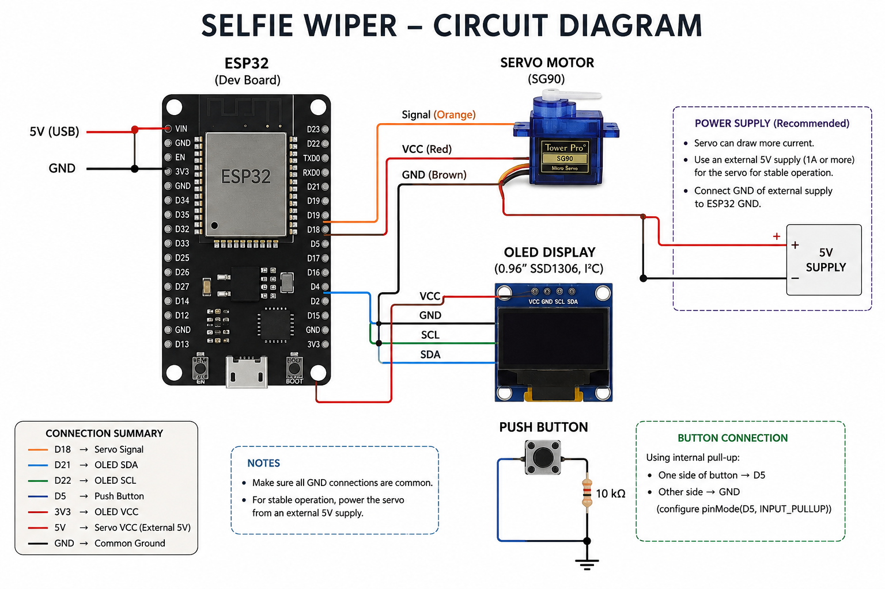
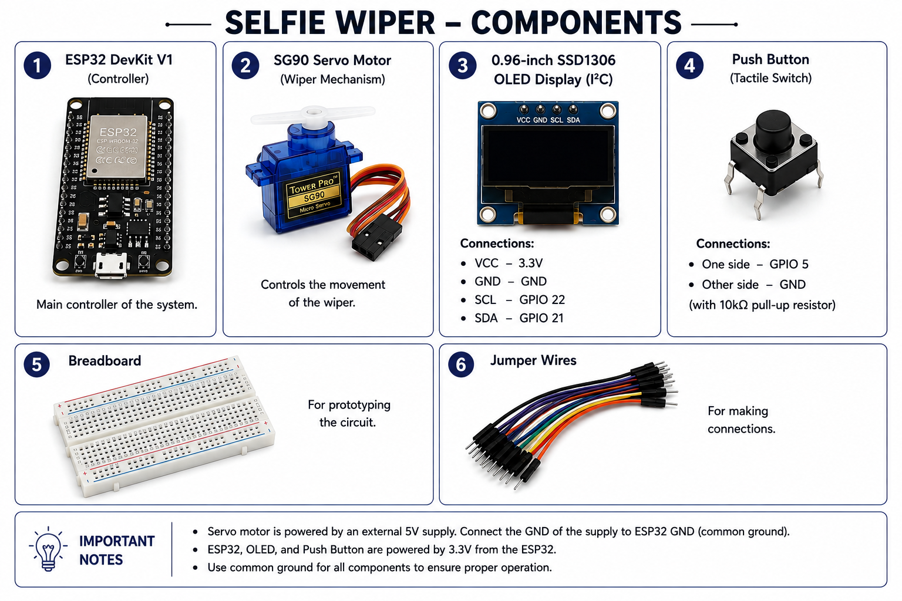
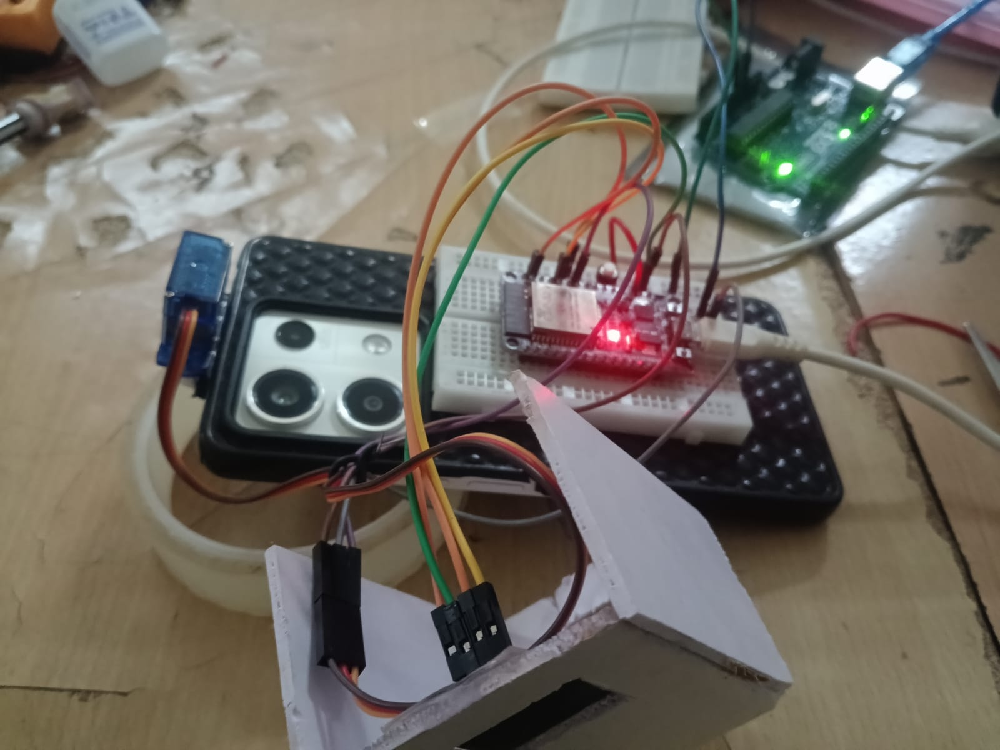
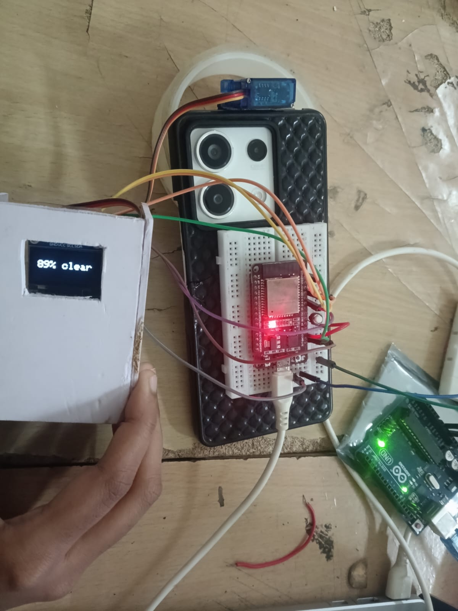

# Selfie Wiper

## Basic Details
### Team Name: [Electrotops]

### Team Members
- Member 1: Abirami Sankar - scms school of engineering and technology
- Member 2: Devika N S     - scms school of engineering and technology

### Project Description
A smart selfie-camera wiper that uses a servo-driven pendulum mechanism to gently sweep across the camera lens, removing water and dust for a clearer view.
With every button press, the wiper performs a controlled cleaning cycle while the OLED displays the achieved clarity level from 80% to 99%.

### The Problem (that doesn't exist)
A dirty or wet selfie camera can ruin the perfect selfie, forcing users to manually wipe the lens every time, our product can be a fun and creative alternative for that.

### The Solution (that nobody asked for)
Why use your finger or get your clothes dirty when your camera can have its own tiny windshield wiper?

## Technical Details
### Technologies/Components Used
- List main components
1. ESP32 Dev Board
2. SG90 Servo Motor
3. 0.96-inch OLED Display (SSD1306 I²C)
4. Push Button
5. Breadboard
6. Jumper Wires
7. 5V External Power Supply
8. microfiber Wiper Strip
- List specifications
1. The ESP32 acts as the main controller.
2. The push button activates the wiper.
3. The servo motor moves the wiper across the camera.
4. The OLED displays the current status and funny messages.
5. The servo returns to its original position after wiping.

- List tools required
 1. Arduino IDE – Programming and uploading code to ESP32
 2. Git – Version control and project management
 3. GitHub – Online repository for storing and sharing the project
 4. Breadboard – Prototyping the circuit
 5. Jumper Wires – Making circuit connections
 6. Soldering Iron – Permanent connections 
 7. Wire Cutter/Stripper – Preparing wires

### Implementation

# Schematic & Circuit

*Add caption explaining connections*

!Schematic(Add your schematic diagram here)
*Add caption explaining the schematic*

# Build Photos

The project is essentially a ridiculously over-engineered manual selfie-camera windshield wiper: instead of simply wiping the lens, you press the button multiple times to tell the ESP32 how aggressively it should "clean" it, while the OLED proudly reports an increasingly impressive 80% → 99% clarity.
### Project Demo
# Video
[https://drive.google.com/drive/u/1/folders/1ndzFR-gETCY5620Y9F9OwOYA3qWYOJI-]

# Additional Demos
[Add any extra demo materials/links]

## Team Contributions
- [Abirami Sankar]: [code,documentation,problem solving]
- [Devika N S]: [hardware connectios,problem solving]

---
Made with ❤️ at TinkerHub Useless Projects 

